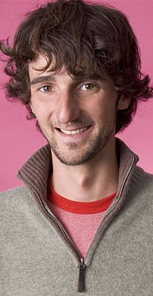
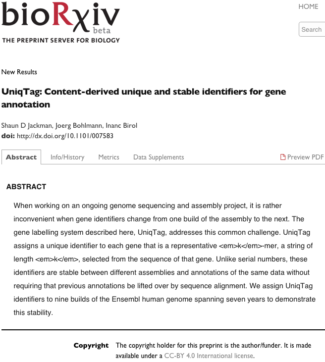
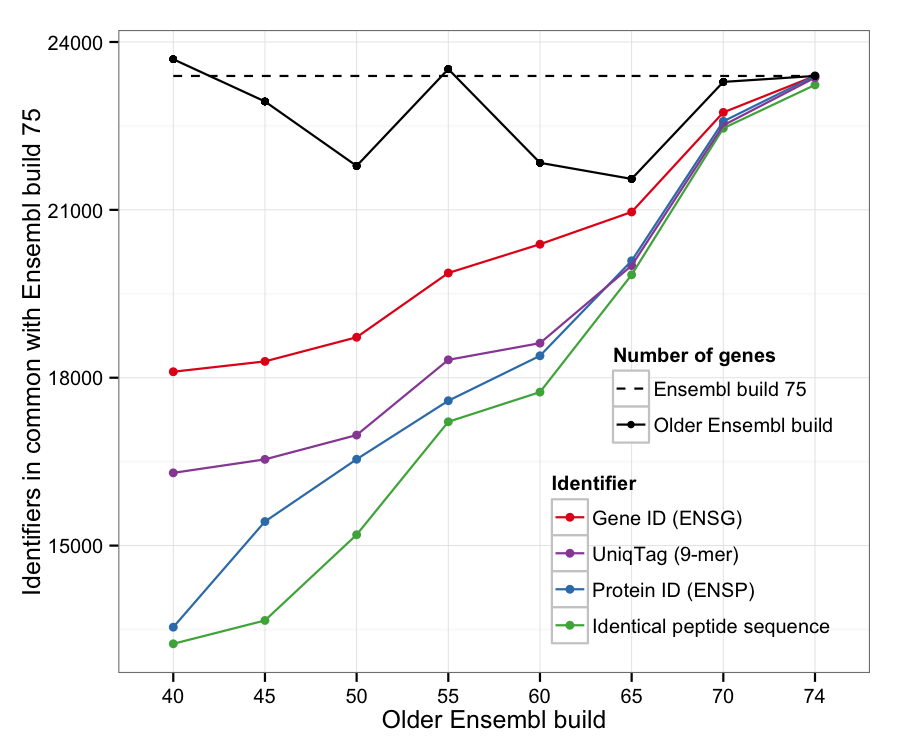

UniqTag
------------------------------------------------------------

Content-derived unique and stable identifiers for gene annotation

Shaun Jackman [\@sjackman][]

2014-08-18

[][cc-by]

[Fork me on GitHub!][]

[\@sjackman]: http://twitter.com/sjackman
[cc-by]: http://creativecommons.org/licenses/by/4.0/
[Fork me on GitHub!]: https://github.com/sjackman/uniqtag-slides

Shaun Jackman
------------------------------------------------------------

| [Genome Sciences Centre][], BC Cancer Agency
| Vancouver, Canada
| [\@sjackman][]
| [github.com/sjackman][]
| [sjackman.ca][]



[Genome Sciences Centre]: http://bcgsc.ca
[github.com/sjackman]: https://github.com/sjackman
[sjackman.ca]: http://sjackman.ca

A reproducible manuscript
================================================================================

One Makefile
------------------------------------------------------------

+ Downloads the data
+ Runs the command-line programs
+ Performs the statistical analyses using [R][]
+ and Generates the TSV tables
+ Renders the figures using [ggplot2][]
+ Renders the supplementary material using [RMarkdown][]
+ Renders the manuscript using [Pandoc][]

[R]: http://www.rstudio.com/
[ggplot2]: http://ggplot2.org/
[RMarkdown]: http://rmarkdown.rstudio.com/
[Pandoc]: http://johnmacfarlane.net/pandoc/

Turns this
------------------------------------------------------------

![[UniqTag Markdown][]](images/UniqTag-md.png)

[UniqTag Markdown]: https://github.com/sjackman/uniqtag-paper/blob/master/UniqTag.md

Into this
------------------------------------------------------------

![[UniqTag PDF][]](images/UniqTag-pdf.png)

[UniqTag PDF]: http://biorxiv.org/content/early/2014/08/01/007583.full.pdf

Open Science
================================================================================

GitHub
------------------------------------------------------------

| The markdown and scripts to render [the paper][],
| the markdown and scripts to render [these slides][] and
| [the software][] are all on [GitHub][].

[the paper]: https://sjackman.github.io/uniqtag-paper
[these slides]: https://sjackman.github.io/uniqtag-slides
[the software]: https://github.com/sjackman/uniqtag
[GitHub]: https://github.com/

bioRxiv
------------------------------------------------------------

The preprint PDF is self archived on [bioRxiv][].



[bioRxiv]: http://biorxiv.org/content/early/2014/08/01/007583

Workflow
================================================================================

------------------------------------------------------------

[Plain Text, Papers, Pandoc][] by [Kieran Healy][]


[Plain Text, Papers, Pandoc]: http://kieranhealy.org/blog/archives/2014/01/23/plain-text/
[Kieran Healy]: http://kieranhealy.org/

Make is beautiful
------------------------------------------------------------

| Tell Make how to create one type of file from another
| and which files you want to create.

. . .

| Make looks at which files you have
| and figures out how to create the files that you want.

Make example
------------------------------------------------------------

```makefile
%.bam: %.sam
	samtools view -Sb $< >$@

%.sort.bam: %.bam
	samtools sort $< $*.sort

%.bam.bai: %.bam
	samtools index $<
```

```bash
touch hello.sam
make hello.sort.bam.bai
```

```bash
samtools view -Sb hello.sam >hello.bam
samtools sort hello.bam hello.sort
samtools index hello.sort.bam
```

Markdown for the manuscript
------------------------------------------------------------

Markdown is a plain-text typesetting language

```markdown
A header
========

A list:

+ This text is *italic*
+ This text is **bold**
```

### A header

A list:

+ This text is *italic*
+ This text is **bold**

RMarkdown
------------------------------------------------------------

+ [RMarkdown][] interleaves text with code in [R][]
+ Code that calculates summary statistics
+ Code that generates tables
+ Code that renders figures using [ggplot2][]
+ [RMarkdown][] is ideal for supplementary material

Pandoc
------------------------------------------------------------

| [Pandoc][] renders attractive documents and slides
| from plain-text typesetting formats

It converts between every format known (just about)

+ Markdown
+ HTML
+ LaTeX
+ PDF
+ ODT and docx (yes, really)

Abstract
================================================================================

------------------------------------------------------------

### When working on an ongoing genome sequencing and assembly project, it is rather inconvenient when gene identifiers change from one build of the assembly to the next.

------------------------------------------------------------

### The gene labelling system described here, UniqTag, addresses this common challenge.

------------------------------------------------------------

### UniqTag assigns a unique identifier to each gene that is a representative *k*-mer, a string of length *k*, selected from the sequence of that gene.

------------------------------------------------------------

### Unlike serial numbers, these identifiers are stable between different assemblies and annotations of the same data without requiring that previous annotations be lifted over by sequence alignment.

------------------------------------------------------------

### We assign UniqTag identifiers to nine builds of the Ensembl human genome spanning seven years to demonstrate this stability.

Results
================================================================================

------------------------------------------------------------



fin
================================================================================

Links
------------------------------------------------------------

| [the paper][] | [these slides][] | [the software][]
| [GitHub][] | [bioRxiv][]
| [R][] | [ggplot2][] | [RMarkdown][] | [Pandoc][]
| [Plain Text, Papers, Pandoc][]

[\@sjackman][] | [github.com/sjackman][] | [sjackman.ca][]

[sjackman.github.io/uniqtag-slides][]

[Fork me on GitHub!][]

[sjackman.github.io/uniqtag-slides]: https://sjackman.github.io/uniqtag-slides

Shaun Jackman
------------------------------------------------------------

| [Genome Sciences Centre][], BC Cancer Agency
| Vancouver, Canada
| [\@sjackman][]
| [github.com/sjackman][]
| [sjackman.ca][]


